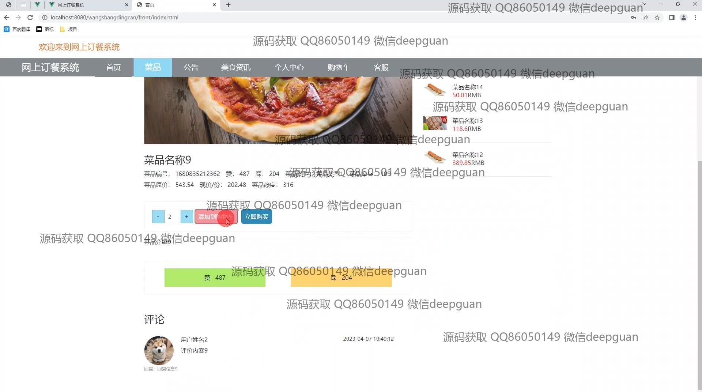
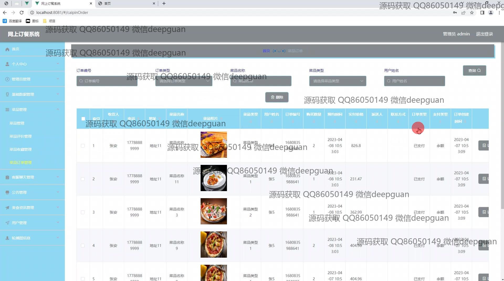
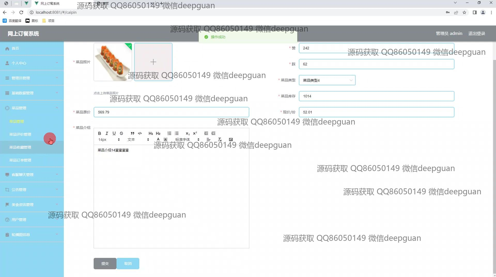

<h1 align="center">网上订餐系统</h1>

## 简介
网上订餐系统：角色分为管理员、用户；功能包括菜品管理、订单管理、用户中心、地址管理、在线支付及客户服务互动，支持美食资讯查看及高级搜索功能，提升用户订餐体验。    --计算机毕业设计源码；毕设源码；java毕业设计源码

## 联系方式

<h3 align="center">获取完整代码与数据库文件 + 微信：deepguan QQ: 86050149 QQ群: 783742310</h3>

<h3 align="center">可帮忙远程部署 包运行成功！提供远程部署、修改代码、设计文档指导、代码讲解等服务！</h3>

## 功能介绍（完整见运行截图）
管理员：管理员可以通过登录界面进入系统，并在后台管理中执行用户管理、店铺管理、菜品管理和美食资讯管理等操作。管理员可查看、编辑和删除用户信息，设置用户的禁用状态，以及重置密码。系统还提供管理员管理的功能，允许新管理员的添加和现有管理员的管理。通过后台，管理员可管理订单、处理客服消息，并维护包括菜单、公告和美食资讯在内的多种数据。后台系统提供菜品的添加、修改和下架等功能，以确保菜品信息的准确性和时效性。

用户：用户通过注册界面填写基本信息后，便可登录系统进行操作。登录后，用户可访问首页查看新品推荐和美食资讯。用户能在菜单模块浏览菜品，查看菜品详情包括价格、库存和其他用户评论。购物流程支持将菜品添加至购物车，选择预约送达时间，并通过确认页面完成订单。这一系统还提供了在线支付模拟功能。用户的个人中心模块允许管理个人信息、地址和收藏夹，并可查看与管理订单详情。此外，用户可通过个人中心修改账号信息如密码，并查看历史订单和支付状态。

## 运行截图

本代码来源于网络,仅供学习参考使用!

